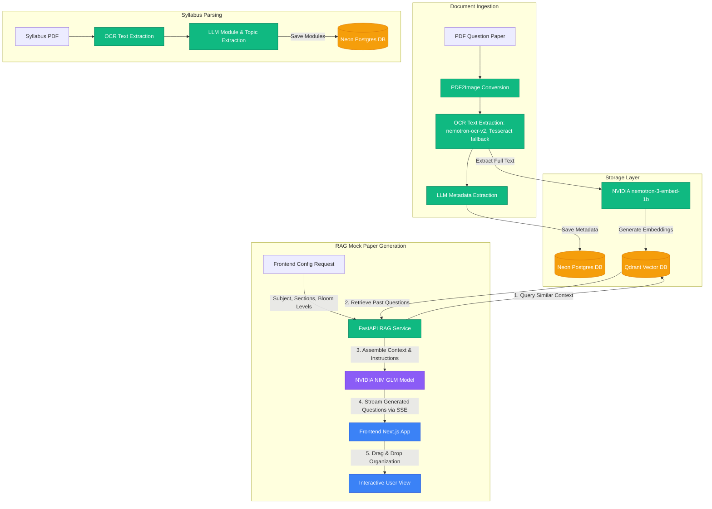

# Prepwise 📚🤖

Prepwise is an AI-powered academic paper repository and smart mock exam generator. The platform ingests past academic question papers and syllabi via OCR, indexes them using semantic vector embeddings, and leverages Retrieval-Augmented Generation (RAG) aligned with Bloom's Taxonomy to generate highly tailored, exam-ready mock question papers with real-time streaming.

---

## 🛠️ System Architecture

The following diagram illustrates the flow of documents through the system (OCR, Metadata Extraction, Vector Embedding, and RAG-based generation):



---

## ✨ Core Features

* **📄 Document Ingestion & OCR Processing:** Supports PDF question paper uploads. Reads each page with NVIDIA's `nemotron-ocr-v2` (Tesseract only if that API call fails) via `pdf2image`, then extracts the header to pull key metadata fields: `subjectCode`, `subjectName`, `semester`, `monthYear`, `time`, and `marks`.
* **📚 Syllabus Breakdown & Analysis:** Uploads syllabus PDFs and extracts core modules, topics covered, and percentage weightages using LLMs. Normalizes syllabus distributions to ensure balanced question coverage.
* **🔍 Semantic Vector Search:** Converts full-text past papers into dense vector embeddings using `nvidia/nemotron-3-embed-1b` and indexes them in a **Qdrant** cluster. Enables semantically searching for exam topics or questions.
* **🧠 Bloom's Taxonomy-Based Generation:** Allows custom mock paper configuration mapped to Bloom's Taxonomy cognitive dimensions (*Remember, Understand, Apply, Analyze, Evaluate, Create*). Automatically verifies if the generated questions utilize target action verbs.
* **⚡ Server-Sent Events (SSE) Streaming:** Generates mock papers by streaming questions in real-time, preventing network timeout issues (e.g. Cloudflare 100s limits) and offering a smooth user experience.
* **✅ Question Validation Engine:** Evaluates generated questions programmatically against strict standards (minimum length, placeholder checks, punctuation checks, complexity matching, and contextual repetition flags).
* **🖐️ Drag-and-Drop Editor:** Reorder, view validation logs, add/remove, and pool optional questions using an interactive UI powered by `@dnd-kit/sortable` in Next.js.

---

## 💻 Tech Stack

| Component | Technology | Description |
| :--- | :--- | :--- |
| **Frontend Framework** | Next.js 16 (App Router) | React-based server and client components |
| **Styling** | Tailwind CSS / CSS Modules | Premium responsive user interface |
| **Logic/State** | TypeScript & React Hooks | Strict-type checks and modular code structure |
| **Drag & Drop** | `@dnd-kit/core` & `@dnd-kit/sortable` | Smooth list reordering and pooling |
| **Backend API** | FastAPI (Python) | High-performance asynchronous API endpoints |
| **Database (Relational)** | NeonDB (PostgreSQL) | Serverless PostgreSQL database for structured data |
| **Database (Vector)** | Qdrant Cloud | Vector database for similarity search and RAG context |
| **OCR Pipeline** | NVIDIA `nemotron-ocr-v2`, Tesseract fallback & `pdf2image` | Optical Character Recognition for document digitizing |
| **LLM Inference** | NVIDIA NIM API | Hosting `z-ai/glm-5.3-flash` & `nvidia/nemotron-3-embed-1b` |

---

## 🗄️ Database Schema

### Neon PostgreSQL

#### 1. `papers` Table

Stores past question papers metadata and links to local files.

```sql
CREATE TABLE papers (
    id SERIAL PRIMARY KEY,
    filename TEXT NOT NULL,
    file_path TEXT NOT NULL,
    subject_code TEXT,
    subject_name TEXT,
    semester TEXT,
    year TEXT,
    time TEXT,
    marks TEXT,
    uploaded_at TIMESTAMP DEFAULT CURRENT_TIMESTAMP
);
```

#### 2. `syllabi` Table

Stores parsed syllabus information mapped to subjects.

```sql
CREATE TABLE syllabi (
    id SERIAL PRIMARY KEY,
    subject_code TEXT UNIQUE NOT NULL,
    subject_name TEXT,
    modules JSONB NOT NULL,
    created_at TIMESTAMP DEFAULT CURRENT_TIMESTAMP
);
```

### Qdrant Vector Collection

* **Collection Name:** `papers`
* **Vector Dimension Size:** `2048`
* **Distance Metric:** `Cosine`
* **Payload Schema:**

```json
    {
      "subject_code": "String",
      "subject_name": "String",
      "year": "String",
      "filename": "String",
      "full_text": "String"
    }
    ```

---

## ⚙️ Environment Variables

Create a `.env` file in the project root containing the following parameters:

```env
# Relational DB Connection
DATABASE_URL=postgresql://<user>:<password>@<host>/<database>?sslmode=require

# NVIDIA LLM & Embedding Endpoints
NVIDIA_API_KEY=nvapi-...
LLM_API_URL=https://integrate.api.nvidia.com/v1/chat/completions
LLM_MODEL=z-ai/glm-5.3-flash

# NVIDIA Embeddings API
NVIDIA_EMBED_API_KEY=nvapi-...
EMBEDDING_API_URL=https://integrate.api.nvidia.com/v1/embeddings
EMBEDDING_MODEL=nvidia/nemotron-3-embed-1b

# Qdrant Vector Search Config
QDRANT_URL=https://<your-qdrant-cluster-url>:6333
QDRANT_API_KEY=...

# Microsoft sign-in (Entra app registration, see "Authentication")
AZURE_CLIENT_ID=<application-client-id>
# Random secret used to hash anonymous uploaders' IP addresses
IP_HASH_SALT=<long-random-string>
# Optional daily limits (defaults shown)
GENERATE_LIMIT_TRIAL=3
GENERATE_LIMIT_VERIFIED=25
UPLOAD_LIMIT_ANON=5
UPLOAD_LIMIT_STUDENT=20
UPLOAD_LIMIT_FACULTY=10
SYLLABUS_LIMIT=10
```

The frontend needs the same client id in `frontend/.env.local`: `NEXT_PUBLIC_AZURE_CLIENT_ID=<same id>`.

---

## 🔐 Authentication

Prepwise uses Microsoft sign-in (Entra ID) for roles and quotas. Anyone can browse, search, and download papers without signing in.

### Roles and permissions

| Capability | Anonymous | Student | Faculty (trial) | Faculty (verified) | Admin |
|---|---|---|---|---|---|
| Browse / search / download papers | ✓ | ✓ | ✓ | ✓ | ✓ |
| Upload papers | ✓ 5/day per IP | ✓ 20/day | – | ✓ 10/day | ✓ unlimited |
| Upload syllabi | – | – | – | ✓ 10/day | ✓ unlimited |
| View syllabi (used by the generator) | – | – | ✓ | ✓ | ✓ |
| Generate mock papers | – | – | ✓ 3/day | ✓ 25/day | ✓ unlimited |
| Manage users (role, verified) | – | – | – | – | ✓ |

### How auth works

The browser signs in with Microsoft via MSAL and sends an access token. FastAPI verifies the signature against Microsoft's published keys, checks audience, issuer (per tenant), expiry and the `access_as_user` scope, then loads the role from Postgres. The frontend only hides buttons; every rule is enforced by the API. Roles are self-declared because the college's Microsoft directory isn't available to this project; trial faculty get a small daily limit, and an admin verifies real faculty. Anonymous uploads are limited per IP address, stored only as a salted hash.

### Setup

1. Microsoft no longer lets a personal account register an app outside a directory, so you need an Entra tenant first. Signing in to [entra.microsoft.com](https://entra.microsoft.com) with a personal account does **not** create one. Free ways to get one:
   - **[Azure for Students](https://azure.microsoft.com/free/students/)** — no credit card, verify with a college email.
   - **[Azure free account](https://azure.microsoft.com/free/)** — asks for a card for identity verification; no charge unless you upgrade.

   Entra ID's **Free** tier covers app registration and sign-in; the paid P1/P2 tiers are not needed. Then sign in to [entra.microsoft.com](https://entra.microsoft.com) with that tenant's account.
2. **App registrations → New registration**
   - Name: `PrepWise`
   - Supported account types: **Accounts in any organizational directory and personal Microsoft accounts**
   - Redirect URI: platform **Single-page application (SPA)**, `http://localhost:3000/auth/redirect`
   - Register.
3. **Authentication:** under Single-page application, add `https://prepwise-opal-three.vercel.app/auth/redirect`. Save.
4. **Manifest:** confirm `"requestedAccessTokenVersion": 2` inside `"api"`. In the older manifest format it's `"accessTokenAcceptedVersion": 2`. Set it if it's `null`, then save.
5. **Expose an API → Application ID URI → Add:** accept `api://<client-id>` and save. **Add a scope:** name `access_as_user`, who can consent **Admins and users**, admin and user consent display name "Access PrepWise as you", State **Enabled**.
6. **API permissions → Add a permission → My APIs → PrepWise → Delegated → `access_as_user` → Add permissions.**
7. Copy the **Application (client) ID** from Overview. Add `AZURE_CLIENT_ID=<id>` to the root `.env`, `NEXT_PUBLIC_AZURE_CLIENT_ID=<id>` to `frontend/.env.local` (create the file; it's gitignored by Next's default `.gitignore`), and to Vercel's `NEXT_PUBLIC_AZURE_CLIENT_ID` project environment variable.

### Admin commands

```bash
python backend/admin_cli.py make-admin you@outlook.com        # after signing in once
python backend/admin_cli.py reprocess --id 7                  # preview re-running paper 7
python backend/admin_cli.py reprocess --id 7 --apply          # write it
docker exec -it prepwise-backend python backend/admin_cli.py reprocess --all   # on the server
```

### Deployment note

nginx must *overwrite* the client IP header (`proxy_set_header X-Forwarded-For $remote_addr;`) so visitors can't fake their IP to reset the anonymous limit. The backend trusts `X-Forwarded-For` from any peer, which is safe only while the backend service publishes no `ports:` and only nginx shares its `nginx-network` — if either changes, restrict `FORWARDED_ALLOW_IPS` to nginx's address.

**Behind Cloudflare:** trusting `CF-Connecting-IP` (or `$http_cf_connecting_ip`) blindly is unsafe if the origin is reachable directly — anyone can set their own `CF-Connecting-IP` header and get unlimited anonymous upload buckets. Only take it from requests that actually came from Cloudflare, by restricting `set_real_ip_from` to [Cloudflare's published IP ranges](https://www.cloudflare.com/ips/), then forward the result as `X-Forwarded-For`:

```nginx
# Repeat set_real_ip_from for every range at https://www.cloudflare.com/ips/
set_real_ip_from 173.245.48.0/20;
set_real_ip_from 103.21.244.0/22;
# ... (all Cloudflare IPv4 and IPv6 ranges)
real_ip_header CF-Connecting-IP;

location / {
    proxy_set_header X-Forwarded-For $remote_addr;  # now the real client IP
    proxy_pass http://prepwise-backend:8000;
}
```

Or firewall the origin so only Cloudflare's IP ranges can reach it, so `CF-Connecting-IP` can't be forged by a direct request.

### Before merging to `default` (merging deploys)

Pushing to `default` builds the backend image and Vercel deploys the frontend, so do these first:

1. Register the Entra app (see Setup above) and pass the manual sign-in checks locally.
2. On the server, add `AZURE_CLIENT_ID` and `IP_HASH_SALT` (a long random string) to the `.env`, and copy the updated `docker-compose.yml` there (it passes the new variables and `FORWARDED_ALLOW_IPS` to the container).
3. Set `NEXT_PUBLIC_AZURE_CLIENT_ID` in Vercel's project environment variables.
4. Apply the nginx real-IP config above.
5. Run `python -m pytest` locally.
6. After the new container starts, check its log for "Database initialisation failed" (the tables are created at startup and it isn't retried), then run `make-admin` for your account.

Without the Entra/Vercel settings, generation and syllabus upload become unavailable to everyone (they now require faculty sign-in). Without `IP_HASH_SALT`, anonymous uploads fail with a 500.

### Tests

```bash
python -m pip install -r backend/requirements.txt -r backend/requirements-dev.txt && python -m pytest
```

An optional `TEST_DATABASE_URL` runs the SQL quota test against a real Postgres database (e.g. a Neon branch) — never production. Run `python -m pytest` locally and make sure it passes before merging a pull request; the `test` job in CI runs on pushes to `default` and gates the image build, it does not run on pull requests.

---

## 🚀 Getting Started

### 📋 Prerequisites

#### 1. Poppler (Required for PDF to Image conversion)

* **Windows:** Download the latest binary zip from [poppler-windows](https://github.com/oschwartz10612/poppler-windows/releases), extract it, and add the `/bin` folder to your System PATH variables.
* **macOS:** Install via Homebrew: `brew install poppler`
* **Linux (Ubuntu/Debian):** Install via APT: `sudo apt-get install -y poppler-utils`

#### 2. Tesseract OCR (fallback when the OCR API call fails)

* **Windows:** Download the installer from [UB Mannheim Tesseract](https://github.com/UB-Mannheim/tesseract/wiki), install it, and add the installation folder (e.g. `C:\Program Files\Tesseract-OCR`) to your System PATH.
* **macOS:** Install via Homebrew: `brew install tesseract`
* **Linux (Ubuntu/Debian):** Install via APT: `sudo apt-get install -y tesseract-ocr`

---

### 📥 1. Backend Setup

1. Navigate to the `backend` directory:

    ```bash
    cd backend
    ```

2. Create and activate a virtual environment:

    ```bash
    python -m venv venv

    # Windows Command Prompt
    venv\Scripts\activate

    # Windows PowerShell
    .\venv\Scripts\Activate.ps1

    # macOS/Linux
    source venv/bin/activate
    ```

3. Install the required Python packages:

    ```bash
    pip install -r requirements.txt
    ```

4. Initialize the database tables and Qdrant collection:

    You can trigger the schema creation using a Python interactive shell:

    ```bash
    python -c "from database import init_db; init_db()"
    ```

5. Start the FastAPI backend server:
    * **On Windows:** Simply double-click or run `run_backend.bat` from the root directory.
    * **Alternative Manual CLI** (run from the project root, so uploads land in `backend/papers`):

    ```bash
    uvicorn main:app --app-dir backend --reload --reload-dir backend --port 8000
    ```

    * The API documentation will be available at: [http://localhost:8000/docs](http://localhost:8000/docs)

---

### 🖥️ 2. Frontend Setup

1. Navigate to the `frontend` directory:

    ```bash
    cd frontend
    ```

2. Install dependencies:

    ```bash
    npm install
    ```

3. Start the Next.js development server:

    ```bash
    npm run dev
    ```

4. Open your browser and navigate to: [http://localhost:3000](http://localhost:3000)

---

## 🛠️ Development & Maintenance Scripts

Inside the `backend/dev-scripts` directory, there are multiple utilities to debug and maintain the platform:

1. **`manage_db.py`:** Syncs database items or drops collections.
    * *Synchronize entries (removes entries pointing to missing files):*

    ```bash
    python backend/dev-scripts/manage_db.py sync
    ```

    * *Reset Postgres tables and Qdrant collections (caution: deletes all data):*

    ```bash
    python backend/dev-scripts/manage_db.py reset
    ```

    * *Re-embed all papers after changing the embedding model (reads the stored full text, no OCR re-run). `reembed` fills a staging collection and is safe to re-run; `finalize-reembed` then replaces `papers` with it after a confirmation:*

    ```bash
    python backend/dev-scripts/manage_db.py reembed
    python backend/dev-scripts/manage_db.py finalize-reembed
    ```

2. **`debug_pipeline.py`:** Checks if the PDF conversion, OCR engine, and metadata extraction endpoints are working correctly.
    * *Usage:*

    ```bash
    python backend/dev-scripts/debug_pipeline.py <path_to_pdf>
    ```

3. **`test_rag.py` / `test_rag_debug.py`:** Tests similarity retrieval and GLM mock-paper generation pipelines locally.
