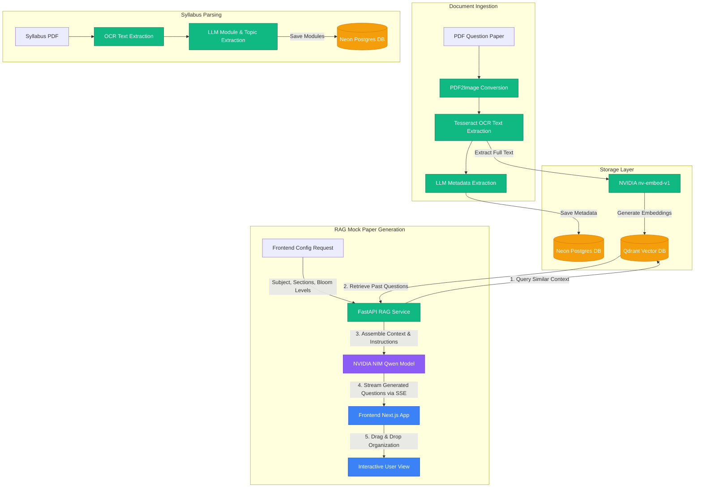

# Prepwise 📚🤖

Prepwise is an AI-powered academic paper repository and smart mock exam generator. The platform ingests past academic question papers and syllabi via OCR, indexes them using semantic vector embeddings, and leverages Retrieval-Augmented Generation (RAG) aligned with Bloom's Taxonomy to generate highly tailored, exam-ready mock question papers with real-time streaming.

---

## 🛠️ System Architecture

The following diagram illustrates the flow of documents through the system (OCR, Metadata Extraction, Vector Embedding, and RAG-based generation):



---

## ✨ Core Features

* **📄 Document Ingestion & OCR Processing:** Supports PDF question paper uploads. Automatically extracts headers and cleans them using `pytesseract` and `pdf2image` to pull key metadata fields: `subjectCode`, `subjectName`, `semester`, `monthYear`, `time`, and `marks`.
* **📚 Syllabus Breakdown & Analysis:** Uploads syllabus PDFs and extracts core modules, topics covered, and percentage weightages using LLMs. Normalizes syllabus distributions to ensure balanced question coverage.
* **🔍 Semantic Vector Search:** Converts full-text past papers into dense vector embeddings using `nvidia/nv-embed-v1` and indexes them in a **Qdrant** cluster. Enables semantically searching for exam topics or questions.
* **🧠 Bloom's Taxonomy-Based Generation:** Allows custom mock paper configuration mapped to Bloom's Taxonomy cognitive dimensions (*Remember, Understand, Apply, Analyze, Evaluate, Create*). Automatically verifies if the generated questions utilize target action verbs.
* **⚡ Server-Sent Events (SSE) Streaming:** Generates mock papers by streaming questions in real-time, preventing network timeout issues (e.g. Cloudflare 100s limits) and offering a smooth user experience.
* **✅ Question Validation Engine:** Evaluates generated questions programmatically against strict standards (minimum length, placeholder checks, punctuation checks, complexity matching, and contextual repetition flags).
* **🖐️ Drag-and-Drop Editor:** Reorder, view validation logs, add/remove, and pool optional questions using an interactive UI powered by `@dnd-kit/sortable` in Next.js.

---

## 💻 Tech Stack

| Component | Technology | Description |
| :--- | :--- | :--- |
| **Frontend Framework** | Next.js 16 (App Router) | React-based server and client components |
| **Styling** | Tailwind CSS / CSS Modules | Premium responsive user interface |
| **Logic/State** | TypeScript & React Hooks | Strict-type checks and modular code structure |
| **Drag & Drop** | `@dnd-kit/core` & `@dnd-kit/sortable` | Smooth list reordering and pooling |
| **Backend API** | FastAPI (Python) | High-performance asynchronous API endpoints |
| **Database (Relational)** | NeonDB (PostgreSQL) | Serverless PostgreSQL database for structured data |
| **Database (Vector)** | Qdrant Cloud | Vector database for similarity search and RAG context |
| **OCR Pipeline** | Tesseract-OCR & `pdf2image` | Optical Character Recognition for document digitizing |
| **LLM Inference** | NVIDIA NIM API | Hosting `qwen/qwen3-next-80b-a3b-thinking` & `nvidia/nv-embed-v1` |

---

## 🗄️ Database Schema

### Neon PostgreSQL

#### 1. `papers` Table

Stores past question papers metadata and links to local files.

```sql
CREATE TABLE papers (
    id SERIAL PRIMARY KEY,
    filename TEXT NOT NULL,
    file_path TEXT NOT NULL,
    subject_code TEXT,
    subject_name TEXT,
    semester TEXT,
    year TEXT,
    time TEXT,
    marks TEXT,
    uploaded_at TIMESTAMP DEFAULT CURRENT_TIMESTAMP
);
```

#### 2. `syllabi` Table

Stores parsed syllabus information mapped to subjects.

```sql
CREATE TABLE syllabi (
    id SERIAL PRIMARY KEY,
    subject_code TEXT UNIQUE NOT NULL,
    subject_name TEXT,
    modules JSONB NOT NULL,
    created_at TIMESTAMP DEFAULT CURRENT_TIMESTAMP
);
```

### Qdrant Vector Collection

* **Collection Name:** `papers`
* **Vector Dimension Size:** `4096`
* **Distance Metric:** `Cosine`
* **Payload Schema:**

```json
    {
      "subject_code": "String",
      "subject_name": "String",
      "year": "String",
      "filename": "String",
      "full_text": "String"
    }
    ```

---

## ⚙️ Environment Variables

Create a `.env` file in the project root containing the following parameters:

```env
# Relational DB Connection
DATABASE_URL=postgresql://<user>:<password>@<host>/<database>?sslmode=require

# NVIDIA LLM & Embedding Endpoints
NVIDIA_API_KEY=nvapi-...
LLM_API_URL=https://integrate.api.nvidia.com/v1/chat/completions
LLM_MODEL=qwen/qwen3-next-80b-a3b-thinking

# NVIDIA Embeddings API
NVIDIA_EMBED_API_KEY=nvapi-...
EMBEDDING_API_URL=https://integrate.api.nvidia.com/v1/embeddings
EMBEDDING_MODEL=nvidia/nv-embed-v1

# Qdrant Vector Search Config
QDRANT_URL=https://<your-qdrant-cluster-url>:6333
QDRANT_API_KEY=...
```

---

## 🚀 Getting Started

### 📋 Prerequisites

#### 1. Poppler (Required for PDF to Image conversion)

* **Windows:** Download the latest binary zip from [poppler-windows](https://github.com/oschwartz10612/poppler-windows/releases), extract it, and add the `/bin` folder to your System PATH variables.
* **macOS:** Install via Homebrew: `brew install poppler`
* **Linux (Ubuntu/Debian):** Install via APT: `sudo apt-get install -y poppler-utils`

#### 2. Tesseract OCR (Required for Text Extraction)

* **Windows:** Download the installer from [UB Mannheim Tesseract](https://github.com/UB-Mannheim/tesseract/wiki), install it, and add the installation folder (e.g. `C:\Program Files\Tesseract-OCR`) to your System PATH.
* **macOS:** Install via Homebrew: `brew install tesseract`
* **Linux (Ubuntu/Debian):** Install via APT: `sudo apt-get install -y tesseract-ocr`

---

### 📥 1. Backend Setup

1. Navigate to the `backend` directory:

    ```bash
    cd backend
    ```

2. Create and activate a virtual environment:

    ```bash
    python -m venv venv

    # Windows Command Prompt
    venv\Scripts\activate

    # Windows PowerShell
    .\venv\Scripts\Activate.ps1

    # macOS/Linux
    source venv/bin/activate
    ```

3. Install the required Python packages:

    ```bash
    pip install -r requirements.txt
    ```

4. Initialize the database tables and Qdrant collection:

    You can trigger the schema creation using a Python interactive shell:

    ```bash
    python -c "from backend.database import init_db; init_db()"
    ```

5. Start the FastAPI backend server:
    * **On Windows:** Simply double-click or run `run_backend.bat` from the root directory.
    * **Alternative Manual CLI:**

    ```bash
    uvicorn backend.main:app --reload --port 8000
    ```

    * The API documentation will be available at: [http://localhost:8000/docs](http://localhost:8000/docs)

---

### 🖥️ 2. Frontend Setup

1. Navigate to the `frontend` directory:

    ```bash
    cd frontend
    ```

2. Install dependencies:

    ```bash
    npm install
    ```

3. Start the Next.js development server:

    ```bash
    npm run dev
    ```

4. Open your browser and navigate to: [http://localhost:3000](http://localhost:3000)

---

## 🛠️ Development & Maintenance Scripts

Inside the `backend/dev-scripts` directory, there are multiple utilities to debug and maintain the platform:

1. **`manage_db.py`:** Syncs database items or drops collections.
    * *Synchronize entries (removes entries pointing to missing files):*

    ```bash
    python backend/dev-scripts/manage_db.py sync
    ```

    * *Reset Postgres tables and Qdrant collections (caution: deletes all data):*

    ```bash
    python backend/dev-scripts/manage_db.py reset
    ```

2. **`debug_pipeline.py`:** Checks if the PDF conversion, OCR engine, and metadata extraction endpoints are working correctly.
    * *Usage:*

    ```bash
    python backend/dev-scripts/debug_pipeline.py <path_to_pdf>
    ```

3. **`test_rag.py` / `test_rag_debug.py`:** Tests similarity retrieval and Qwen mock-paper generation pipelines locally.
